# KMeans_mri_MapReduce
Implementation of Kmeans algorithme on brain MRI, in a parallel manner with MapReduce

 

## Demos

### demo 1

> input :  3 random centers & a small Gif image

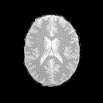

> output  : 

1 * |  2 *  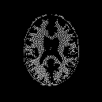|  3 *  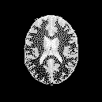

 

### demo 2

> input : 3 random centers & a large JPEG image

> output  : 

1 * 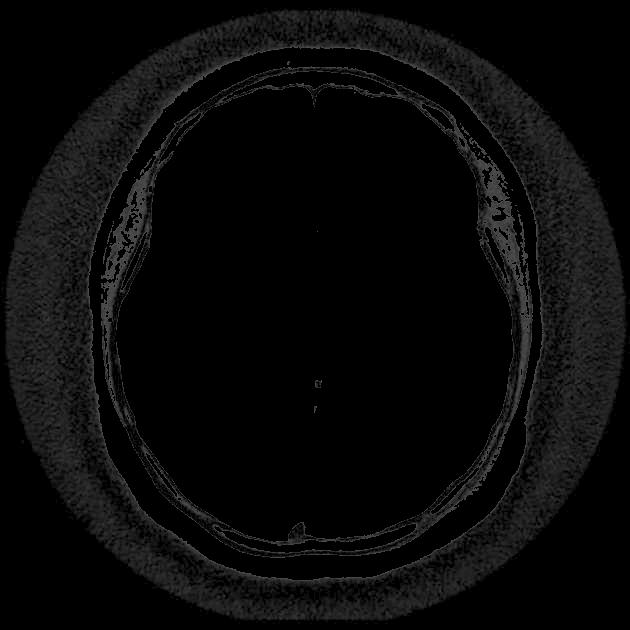|  2 *  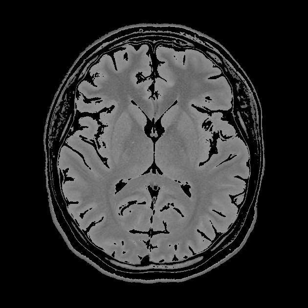 | 3 *  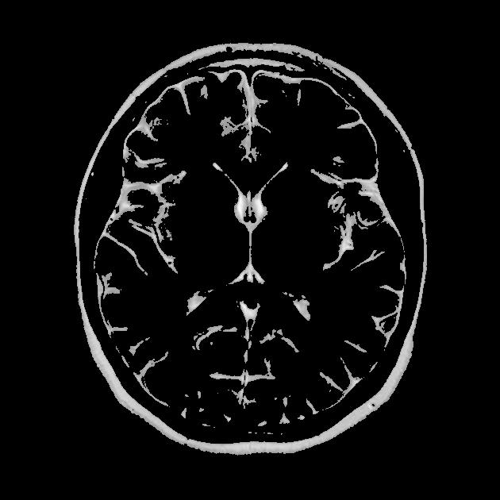

 

### demo 3

> input : 8 centers & large JPEG image

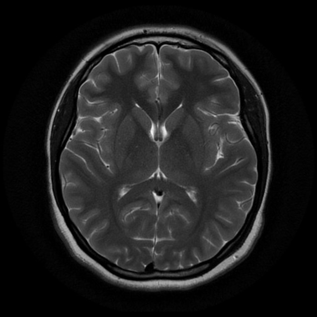

> output : 

 1 * 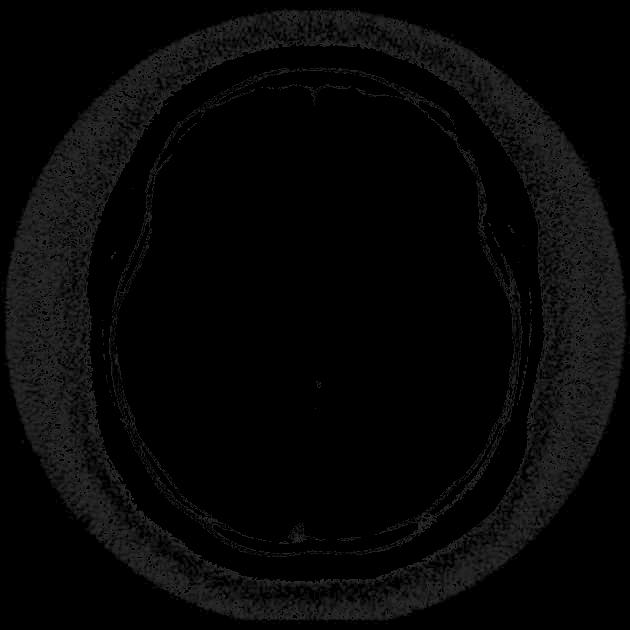 | 2 *  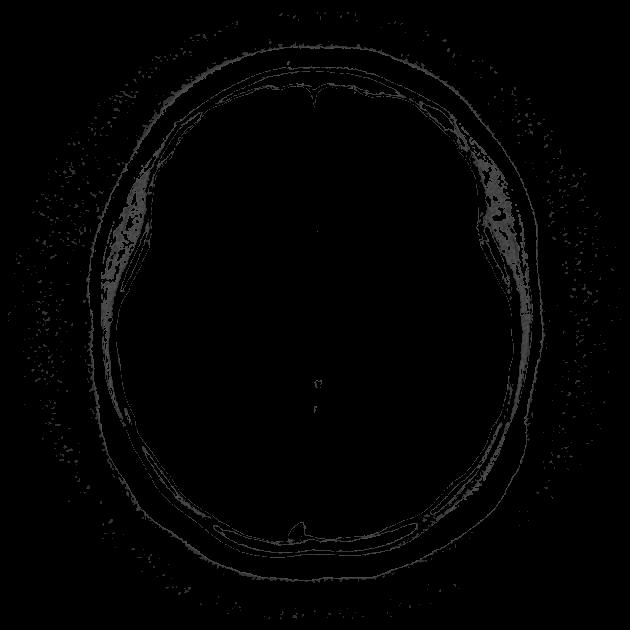 | 3 *  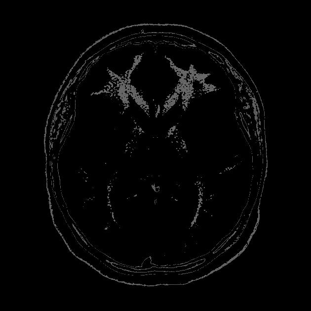 | 4 *    | 5 *   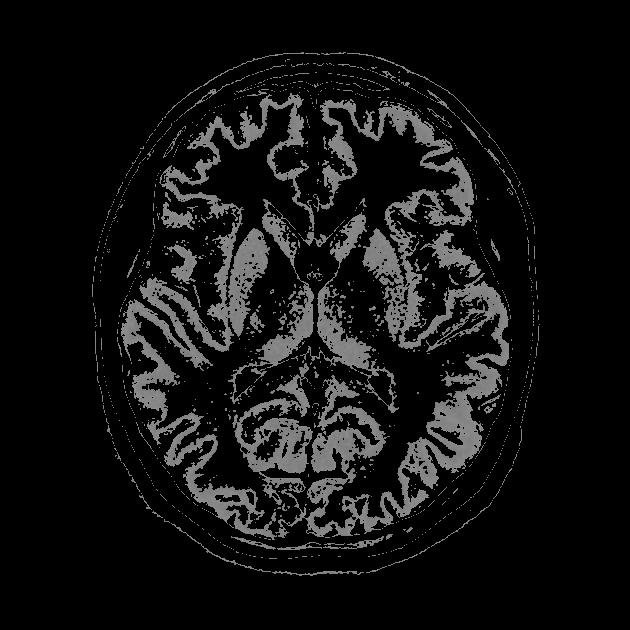 | 6 *   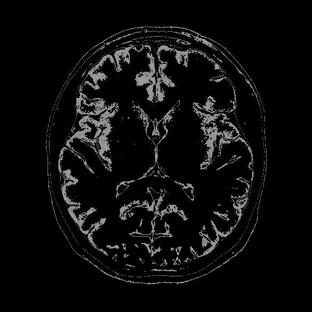 | 7 *    | 8 *   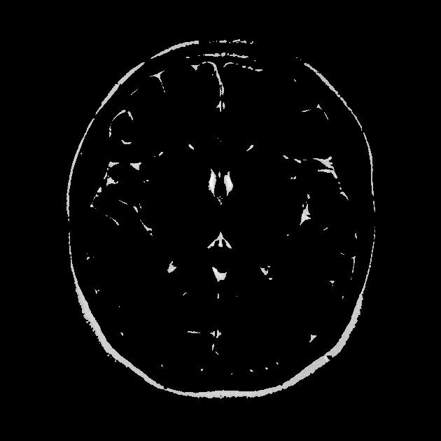
 

> .

